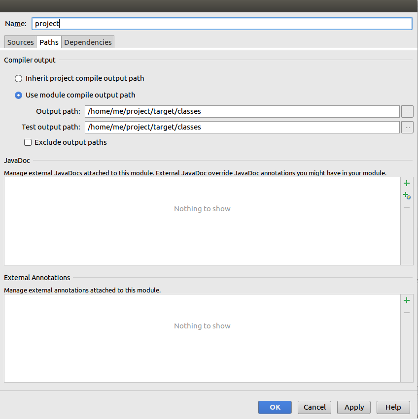
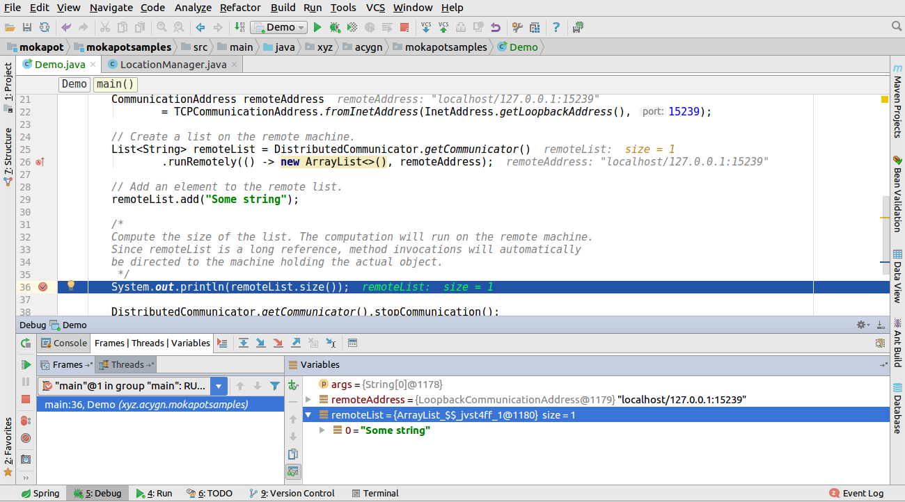
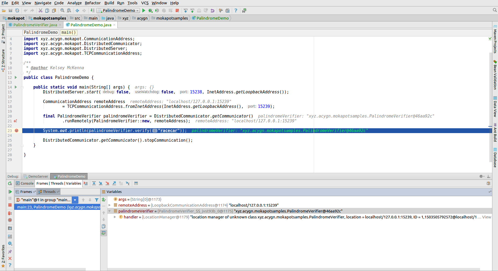
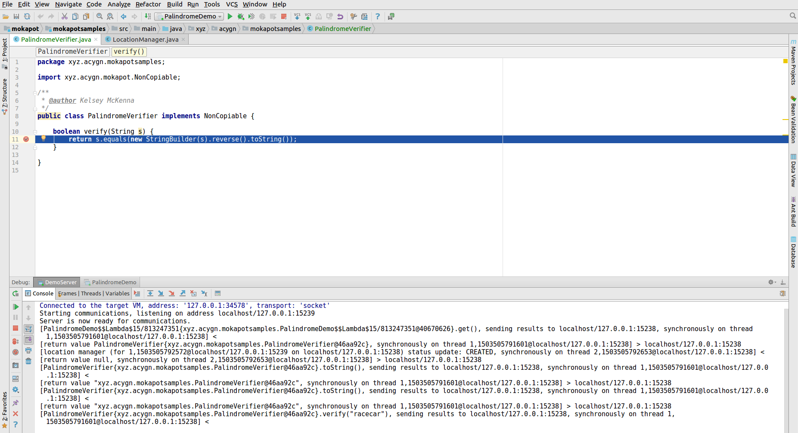

Buildling/installing/debugging Mokapot
======================================

How to add a dependency on Mokapot
----------------------------------

### Maven

One of the easiest ways to add Mokapot as a dependency to your
application is to use Maven and add the dependency to your `pom.xml`
file:

```xml
<dependency>
    <groupId>xyz.acygn</groupId>
    <artifactId>mokapot</artifactId>
    <version>1.0-SNAPSHOT</version>
</dependency>
```

When you build the application with `mvn clean install`. To use this
option, please install the latest release of Maven.

### Gradle

```
dependencies {
    compile 'xyz.acygn:mokapot:1.0-SNAPSHOT'
}
```

If you build Mokapot with Maven on your local machine, you may need to
add the following:

```
repositories {
    mavenLocal()
}
``` 

### Command Line

If compiling from the command line, you have two options:

  * Build `mokapot.jar` using `ant jar` (directly or indirectly via an
    IDE), then add `mokapot.jar` to your classpath;
  * Build Mokapot as `.class` files using `ant compile` (again,
    directly or indirectly via an IDE), then add the `classes`
    directory to your classpath.

Mokapot will need to be on your classpath both during your compile,
and while actually running the resulting program.

IDE Setup
---------

As mentioned above, you can easily add Mokapot to your project by
using a dependency management system, such as Maven. You can also add
Mokapot as a compile-time dependency in your IDE by selecting the JAR
file as a library/dependency for your module/project.

You should configure your IDE to place all compiled classes (including
test classes) into the same folder. For example, you can do this in
IntelliJ by clicking `File > Project Structure` then choose the
`Modules` tab and find your module, then set the `Output path` and
`Test output path` fields to the same path.



Testing Mokapot itself
----------------------

Mokapot supports the
[Test Anything Protocol](http://testanything.org); you can thus run
the tests using the command

    prove test.t

The testsuite probably currently only works on UNIX or UNIX-like
operating systems, like Mac OS X or Linux.

If you don't have `prove` installed, `ant test` will also suffice for
running the tests; the output will be less clear (containing raw TAP
directives) but should still be fairly readable, and a summary at the
end will let you know whether the tests passed.

Building the documentation
--------------------------

You can build the documentation in either of two ways:

    ant doc

will build Javadoc for Mokapot's public API (i.e. as Mokapot would be
seen by a user), whereas

    ant doc-private

will build Javadoc for Mokapot's internals in addition to the public
API (in order to help people working on Mokapot itself understand how
it works). The output will be in `doc/` or `doc-private/`
respectively.

You can use

    ant distribution

to get a zip file (`mokapot.zip`) containing documentation, a jar file
containing the Mokapot binaries, and some examples.

Clean
-----

    ant clean

will clean up all files generated by the build system.

Debugging
---------

Here's what the IntelliJ `Frames | Threads | Variables` view looks
like during a run of the example at the start of `Guide.md`:



Importantly, if you step into the `remoteList.size()` call, you will
not step into the usual `ArrayList#size` method; instead code will be
executed that redirects the method call to the machine where the
*actual* object resides (not where the long reference object resides).

In the `PalindromeDemo` code, you can easily debug the code on *both*
machines.  On the 'client' side, a breakpoint is placed just before a
method invocation on a long reference to an object held on a remote
machine.



Stepping over this line of code brings us to a breakpoint in the
`PalindromeVerifier` class, but now we're debugging the code in the
`DemoServer` application!



This is extremely useful to verify that computations are running on
the correct machine.  With seamless debugging out of the box, it's
much easier to identify errors, such as invalid
`Copiable`/`NonCopiable` inference.
